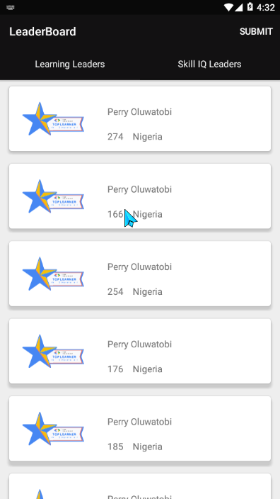
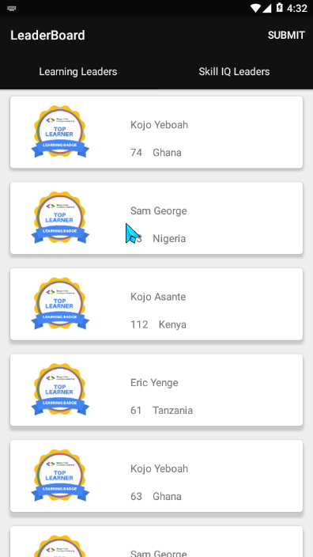
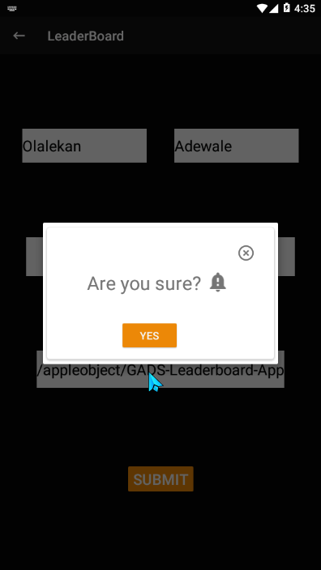
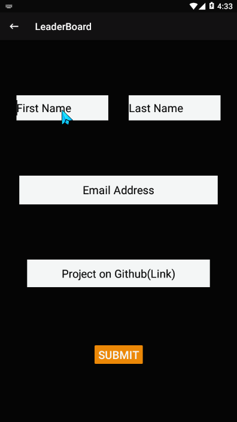
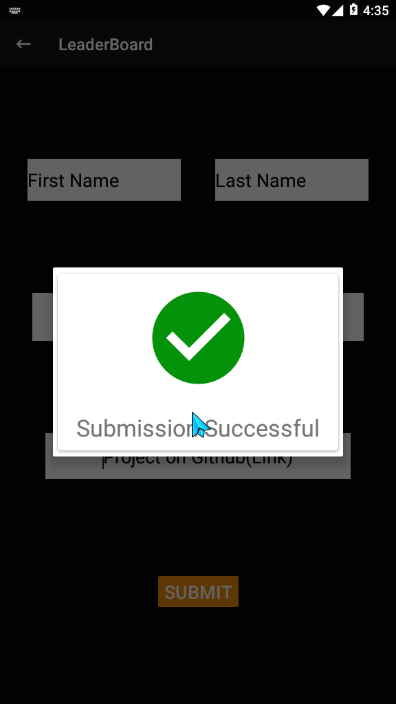

# Building a GADS Leaderboard Mobile Application

This project is a very simple Android Project aimed at getting you to implement some simple concepts 
that are very important as far as Android Development is concerned.

The mobile App will display Top 20 learners in the Learning Leaders’ category and 
Top 20 learners in the Skill IQ Leaders’ category.

## Features 
- Multi-Activity Project
- View pager
- Customizing Toolbar
- RecyclerView
- Making Network Request
- Working with Google Form and many more...

### Resources
- Data coming from the following API endpoints
[Base URL] - (https://gadsapi.herokuapp.com)
[Learning Leaders] - (/api/hours)
[Skill IQ Leaders] - (/api/skilliq)

#### Screenshots

